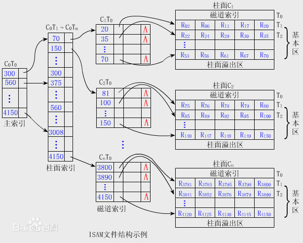

## 操作系统之文件系统
### 机械硬盘的引入
```
在操作系统的教材中, 有对文件系统进行了详细的讲解, 首先我们需要知道的是, 对于一个机械硬盘来说, 分为
一个个的盘面, 如下图所示, 其为机械硬盘的立体表现形式, 在盘面中, 会有磁道、扇区两个概念, 磁道即图中
一圈圈的表示, 扇区位于磁道中, 一个磁道会被分为多个扇区, 一个文件的数据就被存储在这些扇区当中, 扇区
是机械硬盘的最小读写单位, 多个扇区构成一个磁盘块, 也称为盘块, 盘块是操作系统引入的概念, 通常将每2的
n次方个扇区称为一个盘块, 操作系统在分配存储空间给一个文件的时候, 就是以盘块作为基本的分配单位的
```


### 外存的组织方式
```
当一个文件被创建的时候, 操作系统会为之分配一个个的盘块, 文件的内容即存储在这些盘块中, 外存的组织方式
指的是一个文件所用的盘块空间是如何分配和查找的, 根据操作系统的磁盘存储器的管理一章节的内容可以看到,
外存的组织方式主要有三种: 连续组织方式、链接组织方式、索引组织方式

接下来我们简单的介绍一下前两种组织方式, 再重点介绍索引组织方式, 该方式与MySQL的B+树索引是存在异曲
同工之妙的

连续组织方式: 为一个文件分配的一个个盘块是连续的, 即一连串的扇区, 优点是顺序访问是非常容易的, 并且
            速度是非常快的, 而缺点是, 在该文件被创建时就要分配指定个数的盘块, 由于大部分情况下我们
            无法直接估算一个文件的大小, 所以分配起来也是比较困难的, 其次, 一旦分配后, 不易扩展, 因
            为该文件所占据的一段连续的盘块前后已经被其它文件所占据了, 所以就不能再分配了, 即由于估
            算不准文件的大小, 可能会造成空间浪费或者不足的情况

链接组织方式: 链接组织方式主要分为两种, 分别是隐式链接和显示链接方式, 链接组织方式允许盘块分布在任
            意的地方, 从而可以方便地扩展文件的大小, 避免了外部碎片的产生, 隐式链接方式情况下的盘块,
            通过盘块末尾的一块空间来指向下一个盘块, 缺点是不能随机的读取盘块, 比如我要找到第i块盘
            块中的内容, 我就必须先把其前面的盘块的内容读入内存, 从而可以根据盘块末尾的指针来找到下
            一个盘块。显示链接方式正是解决了这个问题, 盘块存放在外存中的任意位置, 对于一个文件中所
            占据的盘块, 将该盘块号记录在指定的文件中, 这个文件FAT(File Allocation Table), 所有
            文件占据的盘块的数据都存储在这个FAT文件中, 缺点就是当我们需要读取一个文件的内容的时候,
            需要先把这个FAT文件读取到内存中, 再从中读取对应的文件的盘块信息, 而通常情况下这个FAT
            文件是非常大的
```

### 外存的组织方式(索引组织方式)
```
显示链接方式存在的缺点是FAT文件很大, 即使我们只读取一个很小的文件, 也需要将FAT文件读入到内存中, 于
是为了解决这个问题, 我们可以将一个文件的盘块信息与文件内容聚集在一起, 当读取一个文件的时候, 先读取
其对应的盘块信息对应的那块盘块, 从而读到自己需要的内容, 这就是索引组织方式, 即单独分出一块盘块来存
放该文件的盘块信息, 读取一个文件的时候先读取其盘块信息, 但是当一个文件很大的时候, 一个盘块可能存放
不下该文件占据的盘块的信息, 从而需要多个盘块来存储, 文件很大的时候, 可能需要大量的盘块来存储其盘块
信息, 举个简单的例子, 假设一个文件占据了一万个盘块, 一个盘块只能存储500个盘块的信息, 那么就需要20
个盘块来存储这一万个盘块的信息, 所以每次随机读取文件的数据的时候, 都需要先将这20个盘块一个个的读入
内存, 假设文件更大, 那么这也是低效的, 这就诞生了二级索引, 多级索引, 如下图所示(摘自百度百科-多级
索引组织方式)
```




### MySQL索引底层B+树原理
```
MySQL的索引是为了提高检索速度的, 索引是一个有序的能够让我们快速查找对应数据的一种数据结构, 在MySQL
中的数据, 最终也是存放在文件系统中的, 也会用一个个的盘块来进行存储, 对于MySQL来说, 每次只会读取一
页的内容(在InnoDB引擎下是16K), MySQL的索引底层为B+树, B+树的节点我们可以认为是一个个的磁盘块, 如
下图所示(摘自百度图片), 一个磁盘块中会存储着一个个的索引值:

B+树的特点:
  <1> B+树分为叶子节点和非叶子节点(内部节点), B+树是一个平衡多叉树
  <2> 索引数据存在非叶子节点中, 真正的数据存在叶子节点中(这里主要以主键唯一索引为例)
  <3> 每个叶子节点之前都会以指针的方式进行相连

如下图所示, 就是一个B+树索引, 其实仔细看看, 会发现其和文件系统中的那个多级索引是相似的, 叶子节点存储
的是真正的数据, 对应文件系统中磁盘空间, 而对这些磁盘空间/真正的数据进行访问都是通过索引来进行检索的,
```


### MySQL的B+树索引与B树索引的区别
```
对于B+树来说, 真正的数据存放在叶子节点, 而上层节点即非叶子节点存储的时候索引数据, 对于B树来说, 其
索引和数据都存在于一个节点中, 这个节点可以是叶子节点或者非叶子节点, 那么这两者有什么区别呢?B+树的这
种索引组织方式是更加的高效的, 首先我们想一下如果是B树的组织方式, 索引和数据存储在同一个节点的情况下,
那么一个节点(可以理解为一个文件系统中的一个盘块)所能存储的数据行(MySQL中的一行行数据)就越少, 整个
索引和真正的数据如果要利用B树来存储的话, 由于一个节点存储的数据少, 就会导致节点数量增多, 进而导致
树的高度会越来越高, 但是B+树就不一样的, 其所有数据都存放在叶子节点上, 上层的非叶子节点(内部节点)仅
仅用于存储索引, 这就可以使得一个节点(可以理解为一个文件系统中的一个盘块)存储的索引个数更多, 进而导致
树的高度更小, 由于操作系统每次只读取一个盘块的数据, 一次读取的索引更多, 树的高度越矮, 快速定位数据
的效率就更高了

总结: B+树的索引存放在上层的非叶子节点, 数据存放在叶子节点, 而B树会将数据和索引存储在一起, 使得一个
      节点存储的索引个数相对于B+树是更少的, 相同的数据量下, B+树的高度会更低, 从而检索效率也是更快
      的, 这里额外的引入一下, B+树的叶子节点会通过指针的方式链接起来, 其实就是为了更加方便地顺序访
      问
```

### 索引的检索数据流程
```
在上述的描述中, 我们一直说MySQL的数据是放在叶子节点的, 这仅仅是针对于主键索引而言的, 在主键索引的情
况下, 确实是这样的一种存储方式, 非叶子节点存放了索引值, 叶子节点存放了真实的数据, 从而主键索引也称
为聚簇索引, 表示数据和索引是存放在同一棵B+树中的, 如果我们没有显示的声明主键PrimaryKey, MySQL也会
自动的帮我们隐式的生成的

其实还有其它的索引, 比如唯一索引, 联合索引, 这两个索引的组织方式虽然是B+树, 但是其叶子节点却不是存储
的真实数据, 而是主键值

通过非聚簇索引检索数据, 首先会通过索引来找到叶子节点, 通过叶子节点的主键值, 来检索聚簇索引B+树, 进
而找到对应的数据, 非聚簇索引检索时最终变成在聚簇索引的检索, 这种情况也叫回表操作, 而这种数据的组织
方式仅仅是针对于Innodb引擎的, 对于MyISAM存储引擎来说, 真正的数据和索引是分开的, 所有类型的索引都会
指向同一块数据区域, 而在Innodb引擎中, 将数据与主键索引给放置在一起了
```
