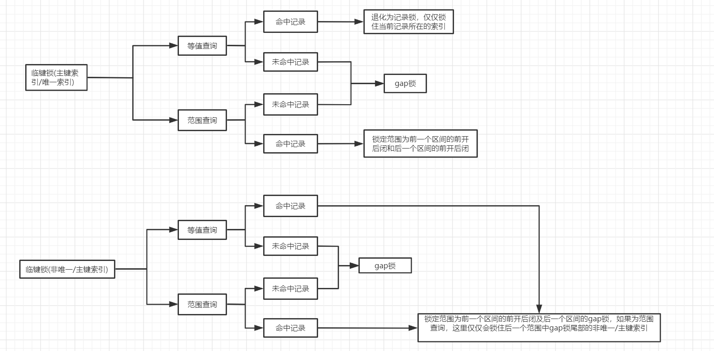

## 引入
```
在MySQL数据库中, 锁的种类有很多, 按照锁的类型可以分为乐观锁、悲观锁或者读锁、写锁, 按照锁的粒度来
分可以分为表锁、行锁, 其中行锁有多种实现, 比如临键锁、间隙锁、记录锁, 在innoDb引擎中行锁的实现默认
为临键锁, 接下来我会一个个的描述这些锁的特点, 并且利用sql来证明这些锁的存在
```

## 乐观锁与悲观锁
```
在上述描述中, 所有的锁均为悲观锁, 悲观锁是真正意义上的锁, 乐观锁严格意义上来说不是真正的锁, 其主要
的思想是利用一个版本号来实现的, 在涉及到金额修改的时候, 一般都需要乐观锁的支持, 举个很简单的例子,
商家想通过app或者网页来修改会员余额, 为了防止在多台设备多个店员同时修改, 需要确保数据库中的余额为自
己本人看到的余额的前提下, 才能修改成功, 这里其实还有行锁的支持, 比如:

update customer set money = [期望修改成的金额] where id = 15 and money = [此时看到的金额]
```

## 行锁
### 前置知识
```
在MySQL中, 常用的存储引擎有MyISM及innodb引擎, innodb引擎才支持行锁, 事务, 而MyISM存储引擎是不支
持的, 我们的CRUD操作中, insert、update、delete会默认给指定的记录加上行锁, 而select语句是不会加任
何锁的, 行锁又分为读锁、写锁, 这里加的锁是写锁, 这个写锁(临键锁)有什么特点我们之后再聊, 在这里我们
不用纠结这个写锁的实现, 而只需要知道其是写锁就好了, 读锁也称为共享锁, 写锁也称为排他锁, 首先我们先
看看如何主动的给记录加锁:

加写锁(排他锁): select * from table where id = 1 for update;
加读锁(共享锁): select * from table where id = 1 lock in share mode;

当我们执行insert、update、delete语句的时候, 加的行锁跟for update加的行锁是一模一样的
```
### 行锁锁住的是什么
```
需要注意的是, 行锁锁住的其实是索引及该索引对应的记录(主键值), 如果一条语句没有用到索引, 那么就会导
致整张表都被锁住, 这个其实和行锁的实现是息息相关的, 需要注意的是, 在后面的所有跟行锁有关的案例中, 
都会确保利用到了索引, 否则会导致锁表的, 我们知道, MySQL会利用主键或者隐藏主键来创建一个聚簇索引, 
聚簇索引实现为B+树的情况下, 叶子节点存储真正的数据库数据, 非叶子节点存储的是索引值, 并且在二级索引
的情况下,检索的时候会先通过二级索引检索到叶子节点, 获取聚簇索引的值, 进而去检索聚簇索引, 最后获取到
需要的数据,在MySQL的行锁中, 锁住的是索引, 而非数据, 在二级索引上加锁的时候, 最后还是要去主键索引上
加锁, 即非主键索引的加锁会分成两步
```

### 行锁的简单实验
```sql
- 该表也会应用在后面的例子中
create table t1 (
	c1 int primary key,
	c2 int,
	c3 int
);

create index t1_c2 on t1 (c2);
insert into t1 values(1, 1, 1), (5, 5, 5), (9, 9, 9), (15, 15, 15);

执行步骤:
  session1:
      begin; // 手动开启事务, 确保事务不会提交
      select * from t1 where c1 = 5 for update;

  session2:
      select * from t1 where c1 = 5 for update; 阻塞
      select * from t1 where c1 = 5 lock in share mode; 阻塞
      update t1 set c2 = 55 where c1 = 5; 阻塞
      select * from t1 where c1 = 9 for update; 成功
      select * from t1 where c1 = 9 lock in share mode; 成功

  session1:
      select * from t1 where c1 = 5 lock in share mode;

总结:
  <1> 读写锁中, 读读不互斥, 读写互斥, 写写互斥
  <2> 一个会话中获取同一个记录的读写锁是不会引起冲突的
  <3> update、insert、delete语句都会默认加上行锁, 其效果跟for update是一样的
```

### 行锁实现算法一: 临键锁
```
临键锁是行锁的默认实现算法, 其特点是, 当范围查询命中了记录后, 会锁住命中的记录的前开后闭区间, 以上
面的初始数据为例子:
  session1:
    begin;
    select * from t1 where c1 > 5 and c1 < 15 for update;

  session2:
    update t1 set c2 = 99 where c1 = 9; 阻塞
    insert into t1 values(6, 6, 6); 阻塞
    insert into t1 values(11, 11, 11); 阻塞
    insert into t1 values(16, 16, 16); 成功
    select * from t1 where c1 = 5 for update; 成功
    select * from t1 where c1 = 15 for update; 阻塞

通过上面的例子演示, 我们发现, 当我们利用session1执行了增加行锁的功能后, 锁定的空间为(5,9]及(9, 15],
先总结一句话, 当行锁命中了记录后, 会锁住该记录的前面区间前开后闭及后面区间的前开后闭的数据, 这里如果
大家想看效果, 建议用我提供的数据去实验临键锁, 因为有些知识会在之后讲解, 为了防止大家有疑惑, 还是用
我提供的数据看效果好一点, 在文章的最后, 我会进行总结

总结: 假设范围查询时, 命中的记录为b, 该记录前面有a记录, 后面有c记录, 那么锁定的区间为(a, b]及(b, c]
```

### 行锁实现算法二: 间隙锁(Gap锁)
```
行锁的默认实现算法为临键锁, 范围查询的时候, 如果命中了记录, 或者等值查询, 未命中记录, 那么就会锁住
该记录前后区间均为前开后闭的记录, 但是, 当没有命中记录的时候, 此时默认的行锁算法就会退化成Gap锁,
gap锁的特点就是锁定一个前开后闭的区间, 不同的事务中, 允许产生相同范围的间隙锁, 下面同样以上面的原始
数据为例子(刚建好表的数据为例):
  session1:
    begin;
    select * from t1 where c1 > 5 and c1 < 9 for update; 未命中数据, 退化为gap锁, 锁住(5,9]

  session2:
    select * from t1 where c1 = 5 for update; 成功
    insert into t1 values(6,6,6); 失败
    select * from t1 where c1 = 9 for update; 失败
    insert into t1 values(10, 10, 10); 成功
    select * from t1 where c1 > 5 and c1 < 9 for update; 成功
    select * from t1 where c1 = 6 for update; 成功
```

### 行锁实现算法三: 记录锁(Record Lock)
```
当非范围查询的情况下, 如果使用了唯一索引或者主键索引, 并且有数据命中的情况下, 仅仅会锁住记录本身,
而不会锁住范围, 这就是记录锁的特点, 下面以原始数据为例子:
  session1:
    begin;
    select * from t1 where c1 = 5 for update; // c1为主键索引, 命中了记录, 此时为记录锁

  session2:
    select * from t1 where c1 = 5 for update; 阻塞
    insert into t1 values(6, 6, 6); 成功
    insert into t1 values(4, 4, 4); 成功
```

### 临键锁解决幻读问题
```
在read commit事务隔离级别下
  事务一:
    select * from t1 where c1 > 15; // 无记录
  事务二:
    insert into t1 values(16, 16, 16);
  事务一:
    select * from t1 where c1 > 15; // 有记录

分析:
  事务一两次读到的数据不相同, 出现幻读

在repeatable read事务隔离级别下:
  事务一:
    select * from t1 where c1 > 15; // 无记录
  事务二:
    insert into t1 values(16, 16, 16); // 阻塞
  事务一:
    select * from t1 where c1 > 15; // 无记录

由此可见, 利用临键锁退化成的gap锁解决了幻读问题, 使得无法在(15,正无穷]插入数据
```

### 行锁的总结
```
临键锁: 如果命中了记录, 则临键锁生效, 锁住了记录的前一个区间的前开后闭及后一个区间的前开后闭, 但是
        在非主键/非唯一索引的情况下, MySQL对临键锁进行了特殊的处理, 使得后一个区间为gap锁的表现形
        式, 而不是前开后闭了
gap锁: 当范围查询或者等值查询的时候, 如果没有命中记录, 则临键锁退化为gap锁, 如果为主键/唯一索引,
        锁住的是该范围对应的前开后闭区间, gap锁与gap锁之间是相互兼容的, 但是与其它锁是不兼容的
记录锁: 当为等值查询的时候, 如果命中记录的情况下, 如果索引使用的是唯一索引或者主键索引, 则临键锁退
        化成记录锁, 仅仅锁住当前这条记录

临键锁 = gap锁 + 记录锁, 需要注意的是, 临键锁仅仅会出现在innodb引擎中事务隔离级别为Repeatable read
下, 幻读则是用该锁来解决的, 换句话说, 临键锁是innodb引擎下, 事务隔离级别为Repeatable read时的行锁
默认实现算法, 如下图所示, 更好的总结了在索引类型不同的情况下, 以及不同的范围下行锁的表现形式:
```



## 表锁
```
表锁分为读锁和写锁:
  加读锁: lock table [表名] write
  加写锁: lock table [表名] read

在表锁中, 如果对一个表加了读锁, 那么其它事务就不能写入数据, 可以用来实现数据迁移这样的功能, 如果对
一个表加了写锁, 那么其它事务就不能读取数据

当一个表有行锁存在的情况下, 加表锁是会阻塞的, MySQL通过意向锁来实现这个判断是否存在行锁的功能, 意向
共享锁, 当存在行锁之读锁的情况下, 该共享锁则显示为被占用, 不存在的情况下则显示为可用, 意向排他锁, 当
存在行锁之写锁的情况下, 该排他锁显示为被占用, 不存在的情况下则显示为可用, 当为一个表增加表锁的时候,
只需要查看意向共享锁和意向排他锁是否被占用, 就可用判断是否有行锁存在了, 而不用去一个个的扫描每一行
```

## 问题分析
```
create table mytest (
  id int(10) primary key,
  username varchar(10)
);

insert into mytest values(1, "aaa"), (5, "ccc");

执行步骤:
  事务一:
    delete from mytest where id = 2; // 产生一个(1,5]的间隙锁

  事务二:
    delete from mytest where id = 4; // 产生一个(1,5]的间隙锁

  事务一:
    insert into mytest values(3, "bbb"); 阻塞, 因为事务二还持有间隙锁, 等待事务二释放间隙锁

  事务二:
    insert into mytest values(3, "bbb"); 出现死锁, 等待事务一释放间隙锁
```


