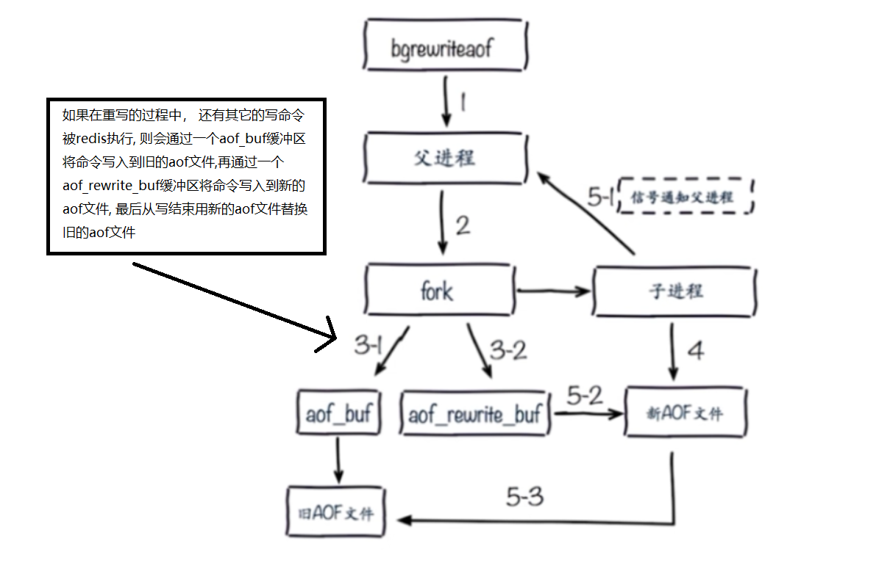

## 持久化描述
```
由于Redis中的数据是存放在内存中的, 当Redis服务器关闭的时候, 内存的数据会随之清空, 我们需要将Redis
中的数据进行保存, 以便下次启动的时候会重新读取这些数据进内存, Redis持久化分为两种, RDB和AOF

RDB模式会将数据写入到一个后缀名为.rdb的文件中, 下次启动时可以重新读取这些数据, 其就相当于MySQL中的
dump文件, 而AOF模式会记录Redis命令的执行流程, 即命令的二进制日志bin.log, 其就相当于MySQL中的二进制
日志, 下次启动时可以根据这些日志信息执行命令, 从而恢复数据
```

## RDB(快照)
- RDB持久化数据的方式
```
方式一(save同步): 手动执行save命令, Redis会陷入阻塞中, 直到文件数据被写入rdb文件中为止, 由于Redis
                 是单线程的, 所以在此期间其它命令会陷入阻塞, 该方式的文件策略是如果存在老的RDB文件,
                 则会用新的替换老的

方式二(bgsave异步): 手动执行bgsave命令, 顾名思义, 就是后台保存, 即Redis会fork启动一个子进程, 利用
                   该进程去生成rdb文件, 并且不会使得Redis陷入阻塞, 该子进程在生成rdb文件时, 会生
                   成一个临时文件, 当持久化操作结束后, 临时文件中的内容才会被写入真正的rdb文件

方式三(自动): 通过配置文件中可以设置自动保存的规则, 默认的规则如下:
          save 900 1: 如果900秒内修改了一次以上, 则900秒后会自动执行bgsave进行保存
          save 300 10: 如果300秒内修改了10次以上, 则300秒后会自动执行bgsave进行保存
          save 60 10000: 如果60秒内修改了10000次以上, 则60秒后会自动执行bgsave进行保存
```

- 配置描述
```
save 900 1: 如果900秒内修改了一次以上, 则900秒后会自动执行bgsave进行保存
save 300 10: 如果300秒内修改了10次以上, 则300秒后会自动执行bgsave进行保存
save 60 10000: 如果60秒内修改了10000次以上, 则60秒后会自动执行bgsave进行保存

dbfilename dump-端口.rdb: 表示生成的rdb文件的文件名, 一般以端口作为区分
dir /opt/redis/data/: 表示redis的日志文件, rdb文件等存放的路径
stop-writes-on-bgsave-error yes: 表示在bgsave时如果出现了错误则停止写入
rdbcompression yes: 表示以压缩文件的形式进行生成rdb文件
rdbchecksum yes: 表示进行检验和

一般不去设置save xxx xxx, 因为没法让我们得知redis生成rdb文件的频率
```

- 会自动触发bgsave的情况
```
全量复制(主从复制)
执行了debug reload命令
执行了shutdown
```

- 不足
```
对于RDB方式的持久化来说, 如果我们选择save进行持久化, 由于redis是单线程的, 所以会陷入阻塞, 如果在阻
塞过程中有其它写命令进来了, 那么一旦发生服务器异常关闭, 则这些写命令就会失效, 从而导致数据的丢失,
而如果我们选择bgsave进行持久化, 则redis会fork一个子进程进行持久化, 虽然达到了异步的效果, 但是会消
耗更多的内存, 对于自动持久化方式来说, 其仍然是采用bgsave进行持久化的, 但是这种方式我们没法控制持久
化的频率
```

## AOF(写日志)
- AOF运行的原理
```
当redis在收到了写命令后, 会将命令放入缓冲区中, 然后根据AOF策略将这些写命令从缓冲区中写入到AOF文件中,
其实就相当于MySQL的二进制日志文件, 在AOF文件中, 记录了这些命令, 下次启动的时候就会读取这些命令, 然
后执行恢复数据了
```

- AOF的三种策略及其优略
```
always: 表示每条命令都会直接从缓冲区中写入到AOF文件中
everysec: 表示每秒会将缓冲区的命令写入到AOF文件中, 同时其也是AOF的默认值
no: 表示根据系统的不同redis会自动判断写入文件的频率

always策略的优点是不会丢失数据, 因为每一条命令都会写入到文件中, 但缺点也很明显, redis在每时每刻都
可能会有大量的写操作, 这样每条写操作都要直接写入文件, 导致IO操作过于频繁

everysec策略的优点是每一秒才进行同步, 缺点是可能会导致有一秒的数据丢失情况(服务器挂了)

no策略优点是不用我们去关心其写入文件的频率, 缺点是不可控
```

- AOF的重写
```
根据AOF的策略得知, 我们的对AOF文件的写入是以追加的形式进行的, 所以会导致文件越来越大, 而AOF提供了
重写这个功能, 可以允许我们对AOF文件进行整理, 举个例子, 当我们执行了set name a, set name b
set name c, 三条命令后, 根据AOF默认策略, 这三条命令会被放入缓冲区中, 然后每隔一秒写入到AOF文件中,
三条命令都会被写入到文件中, 但是我们可以知道, 这三条命令的效果等价于set name c, 所以AOF的重写功能
就体现在这里, 其会根据redis内存中的数据, 对命令进行重新规划, 然后覆盖掉原来的AOF文件, AOF重写redis
通过fork一个子进程, 然后通过该进程去执行重写的操作
```

- AOF重写的细节
```
我们通过执行bgrewriteaof启动了AOF重写后, redis会fork一个子进程来进行重写操作, 那么此时会对redis
内存中的数据进行写入到一个AOF文件中, 同时会有两个缓冲区, 一个是命令缓冲区, 一个是重写缓冲区, 在重写
的过程中可能会出现继续有其它写操作执行的情况, 那么对于这些操作来说, 首先是会将命令放入命令缓冲区,
然后根据AOF策略将该缓冲区的命令写入到AOF文件中(旧的AOF文件), 此时还会将这些命令放入一份到重写缓冲区,
由于重写正在进行, 其会生成一个新的AOF文件, 而重写缓冲区的作用就是将重写过程中的写命令同样写入到新的
AOF文件中, 这样在重写的过程中新的AOF文件和旧的AOF文件都会保存到此时写的命令, 重写结束后用新的AOF文件
替换掉旧的AOF文件, 如下图所示
```



- AOF重写触发的时机
```
情况一: 主动调用bgrewriteaof命令
情况二: 当文件的大小的增长大小达到了我们设置的值时, 比如当前AOF文件为100M, 如果我们设置在文件增长
        了100%的时候进行重写, 则当AOF文件变为200M的时候, 会自动触发重写机制, 自动调用bgrewriteaof
        命令
当同时满足下面的情况时会自动触发:
  aof_current_size > auto-aof-rewrite-min-size
  (aof_current_size - aof_base_size) / aof_base_size > auto-aof-rewrite-percentage
```

- AOF重写的配置
```
执行bgrewriteaof命令则是手动开启AOF文件的重写

appendonly yes: 开启AOF功能
appendfilename "appendonly-6379.aof": 指定AOF文件的名称, 配合dir的值确定该文件的位置
appendfsync everysec: AOF策略, 对缓冲区的命令写入到AOF文件的频率
no-appendfsync-on-rewrite yes: 我们知道重写的过程中, bgrewriteaof会使得fork一个子进程, 然后将
                               redis内存中的数据写入到一个新的AOF文件中, 此时会有大量的IO操作,
                               那么如果在重写的过程中, 主进程也在对旧的AOF文件进行写入呢, 由于
                               子进程进行了IO, 所以主进程没法进行IO, 从而会陷入阻塞, 该参数如果
                               设置为yes, 那么就是no appendfsync, 也就是说在重写的过程中, 不允
                               许主进程对旧的AOF文件进行写入, 则命令都会在缓冲区中放着, 设置为
                               yes则可能会导致数据丢失(redis挂了, 则缓冲区的数据没有写入到AOF文
                               件), 设置为no, 则是最安全的方式, 因为允许继续对旧的AOF文件进行写
                               入操作, 但是会造成主进程的阻塞, 因为同一时间只能一个IO操作
如果不能容忍redis有延迟, 但是可以容忍部分数据丢失, 则可以设置为yes, 这样旧不会陷入阻塞了, 如果不能
容忍数据丢失, 则需要设置为no, 但是可能会有阻塞的情况

auto-aof-rewrite-min-size: AOF重写需要的尺寸(默认设置为64mb)
auto-aof-rewrite-percentage: AOF文件的增长率(默认100%)
aof_current_size: AOF文件当前的大小
aof_base_size: AOF文件上一次启动或者重写后的大小

aof-load-truncated yes: 如果AOF文件存在错误, 则对AOF文件进行截断错误, 只恢复错误前的数据, 错误引
                        起的位置的后面的数据不进行恢复, 同时会在日志中进行通知
```

- AOF文件解析
```
执行命令:
  set name zhangsan
  set name lisi

less /opt/redis/data/appendonly-6379.aof查看aof文件:
  *3              // 表示后面有三个参数
  $3              // 表示第一个参数为3个字节
  set             // 第一个参数为set
  $4              // 表示第二个参数为4个字节
  name            // 第一个参数为name
  $8              // 表示第三个参数为8个字节
  zhangsan        // 第三个参数为张三, 下面同理
  *3
  $3
  set
  $4
  name
  $4
  lisi

分析: 由上述可得, 可以看到两条命令都被记录了, 此时执行bgrewriteaof, 手动开启重写

less /opt/redis/data/appendonly-6379.aof查看重写后的aof文件:
  *3
  $3
  SET
  $4
  name
  $4
  lisi

分析: 重写后多条命令被整理成了一条命令, 结果没有发生变化
```

## RDB与AOF的对比
```
<1> 如果dir中同时存在rdb文件和aof文件, 则aof文件的优先级更高一点, 也就是说会redis重启后会优先读取
    aof文件, 而不会读取rdb文件
<2> rdb文件采用的是二进制直接存储数据, 文件较aof小, 因为aof文件是记录的命令, 虽然存在重写的功能,
    但是rdb文件仍然更小, 所以在重启redis时读取rdb文件会更加的快
<3> rdb导致数据丢失的几率更加的大, 而AOF则需要根据策略来决定, 如果是always则是不会丢失数据的, 而
    如果是everysec的话, 则可能会丢失一条数据
<4> rdb文件是一个比较重的操作, 因为其会对所有数据进行写入, 而aof文件则是通过将命令追加到原来的aof
    文件中来实现的, 所以比较轻
```


