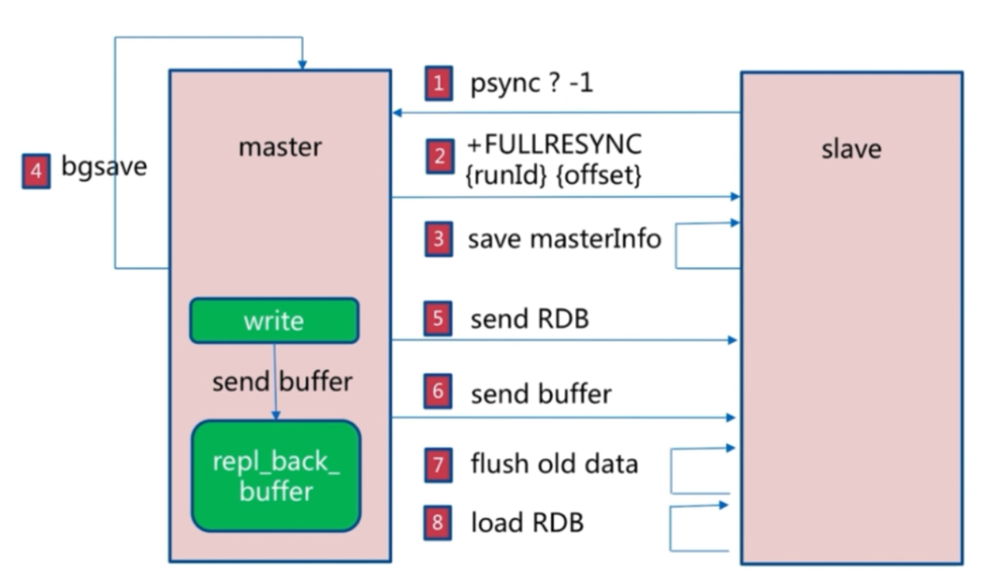
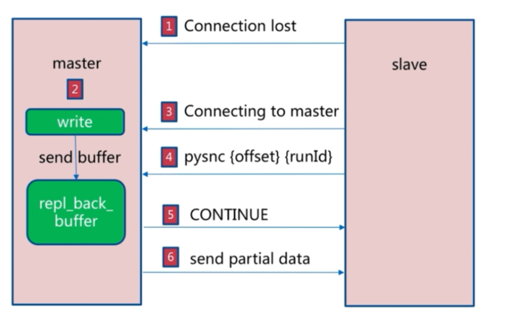

## 主从复制的实现
```
主机不需要进行任何配置, 从机需要进行配置
配置文件方式:
  replicaof host port: 将host和port修改为主机的ip和端口
  replica-read-only yes: 表示从机只读, 不能进行写操作

命令方式:
  slaveof host port: 将host和port修改为主机的ip和端口

从机断开与主机的关系: slaveof no one

查看主从复制相关的信息:
  info replication
  info server
```

## 主从复制的原理简单分析
```
主从复制主要分为三个阶段, 连接建立阶段、数据同步阶段、命令传播阶段, 连接建立阶段是从机主动向主机发送
连接请求, 双方建立连接的过程, 数据同步阶段是从机开始同步主机的数据, 在该节点主要分为全量复制和部分
复制, 命令传播阶段即将主从复制期间主机收到的写命令传送给从机进行同步
```

## 全量复制
- 流程分析
```
全量复制指的是从机会从主机中复制全部的内容, 主要有以下几个步骤：
<1> 主机发送psync命令, 该命令正常情况下需要携带两个参数, runid(主机的runid)和offset(当前从机的数据
    偏移量), 在从机第一次进行同步的时候, 还没有主机的runid以及也没有偏移量, 此时会用?问号来代替runid,
    用-1来表示offset
<2> 主机接收到runid和offset, 判断其为全量复制, 然后把runid发送给从机, 从机进行信息的保存
<3> 主机执行bgsave, 生成rdb文件, 同时维护一个复制缓冲区记录主从复制开启后主机收到的客户端传来的写
    命令, rdb文件生成完成后发送给从机
<4> 从机收到rdb文件后, 首先会flushing old data, 把从机内存中的数据全部清空, 然后读取rdb文件到内存
    中
<5> 主机发送复制缓冲区中的数据给从机(主从复制阶段中主机收到的写命令), 从机收到这些命令后进行执行,
    使得从机一直保持跟主机相同的状态
<6> 如果从机开启了AOF持久化策略, 那么全量复制可能会触发bgrewriteaof的执行, 生成aof文件

注意:
  <1> 全量复制是比较重的操作, 一般我们需要尽可能的避免, 但是首次进行同步时一定是全量复制的
  <2> 全量复制主机会执行bgsave生成rdb文件, 通过Redis持久化分析, 我们知道该操作是比较重的
  <3> 从节点一定会对内存中的数据进行清空才进行读取主机发来的数据
```

- 全量复制的流程图


## 部分复制
- 流程分析
```
全量复制指的是从机会从主机中复制部分内容(复制积压缓冲区), 先对三个概念进行说明:

runid: 主从复制中主机的runid, 是一个唯一id, 用于唯一标识主机的, 主机在重启后runid会发生改变

复制偏移量offset: slave_repl_offset表示从机数据的偏移量, master_repl_offset表示主机数据的偏移量

复制积压缓冲区: 在主机和从机之间出现了网络故障的时候, 比如从机出现了网络故障, 此时没法对数据进行同步,
              则主机会将此时执行的写命令放入复制积压缓冲区中, 该缓存区是一个固定大小的队列, 这意味
              着只能存储一定的命令, 如果新来了一条命令, 而此时缓冲区已经满了, 则根据队列的性质, 最
              前面的命令则会被移除

流程分析:
  <1> 假设从机出现了网络故障, 故障修复后其会继续向主机同步数据, 此时从机会发送psync runid offset,
      runid是主机的runid, offset是从机此时的数据偏移量
  <2> 主机收到这个命令的参数后, 首先根据runid判断得出是否是此时自己的runid, 如果不是, 则表示主机
      重启了或者是第一次进行同步(此时runid是问号), 此时会触发全量复制, 如果是, 则说明之前进行同步
      过, 进入下一步判断
  <3> 主机通过命令的参数中的offset与自己的offset进行对比, 如果两者之差超过了复制积压缓冲区存储的
      范围, 意味着复制积压缓冲区满了后又新来了命令, 导致最先到达的命令被移除了, 此时没法进行部分复
      制, 因为数据不全了, 此时会被转为全量复制, 所以我们一般要根据实际网络情况对复制积压缓冲区的大
      小进行一定的设置(repl-backlog-size)
  <4> 如果offset的差距没有超过复制积压缓冲区的大小, 则会将复制挤压缓冲区的内容发送给从节点进行执行,
      此时即部分复制
```

- 部分复制的流程图


## 命令传播阶段
```
主从复制的数据同步阶段完成后, 从机已经将主机发来的rdb文件进行读取完毕, 此时进入命令传播阶段, 命令
传播阶段中, 主机会将此时接收到的写命令直接发送给从机, 从机接收后执行, 从而保证数据的一致性, 在此阶
段中同时会利用心跳机制来判断主从之间的状态, 主机ping从机, 从机replication ACK offset来回复主机自
己此时的偏移量, 如果两者偏移量不同, 则主机会将偏移量之间的值传送给从机
```